# Execution Plan - MindMirror AI

**Project**: MindMirror AI  
**Type**: Greenfield React Web Application  
**Date**: 2026-05-06  
**Status**: Pending Approval

---

## Detailed Analysis Summary

### Project Characteristics
- **Project Type**: Greenfield (new project, no existing codebase)
- **Primary Goal**: Build complete futuristic AI web application for emotional and productivity analysis
- **Technology Stack**: React, Tailwind CSS, Framer Motion, Recharts
- **Deployment Target**: Vercel (static hosting)

### Change Impact Assessment

#### User-facing Changes
**Yes** - Complete new user experience with three main pages:
- Home dashboard with emotional state overview
- Analysis page with detailed sentiment results and AI suggestions
- Mood history section with 30-day trend visualization

#### Structural Changes
**Yes** - New application architecture with:
- Sentiment analysis engine (keyword-based with weighted scoring)
- Local storage data persistence layer
- Component-based React architecture
- State management for analysis results and history

#### Data Model Changes
**Yes** - New data models for:
- Journal entries (text, timestamps, metadata)
- Analysis results (mood, stress, motivation, confidence, productivity, focus)
- Local storage structure with 30-day retention

#### API Changes
**No** - Pure frontend application, no external APIs

#### NFR Impact
**Yes** - Specific non-functional requirements:
- Performance: Analysis < 500ms, page load < 2s
- Responsive design: Mobile, tablet, desktop breakpoints
- Animations: Smooth 60fps on desktop, reduced on mobile
- Accessibility: Basic semantic HTML and keyboard navigation
- Browser support: Modern browsers only (latest 2 versions)

### Risk Assessment
- **Risk Level**: **Low-Medium**
- **Rationale**: 
  - Greenfield project with no legacy constraints
  - Well-defined requirements with clear technical stack
  - Moderate complexity with multiple interconnected features
  - Lightweight sentiment analysis (no complex ML dependencies)
  - Pure frontend architecture (no backend complexity)
- **Rollback Complexity**: **Easy** (static site deployment, easy to revert)
- **Testing Complexity**: **Moderate** (sentiment analysis logic, UI components, local storage, responsive design)

---

## Workflow Visualization

```mermaid
flowchart TD
    Start(["User Request"])
    
    subgraph INCEPTION["🔵 INCEPTION PHASE"]
        WD["Workspace Detection<br/><b>COMPLETED</b>"]
        RA["Requirements Analysis<br/><b>COMPLETED</b>"]
        US["User Stories<br/><b>SKIP</b>"]
        WP["Workflow Planning<br/><b>IN PROGRESS</b>"]
        AD["Application Design<br/><b>EXECUTE</b>"]
        UG["Units Generation<br/><b>EXECUTE</b>"]
    end
    
    subgraph CONSTRUCTION["🟢 CONSTRUCTION PHASE"]
        FD["Functional Design<br/>(per unit)<br/><b>EXECUTE</b>"]
        NFRA["NFR Requirements<br/>(per unit)<br/><b>EXECUTE</b>"]
        NFRD["NFR Design<br/>(per unit)<br/><b>EXECUTE</b>"]
        ID["Infrastructure Design<br/>(per unit)<br/><b>SKIP</b>"]
        CG["Code Generation<br/>(per unit)<br/><b>EXECUTE</b>"]
        BT["Build and Test<br/><b>EXECUTE</b>"]
    end
    
    subgraph OPERATIONS["🟡 OPERATIONS PHASE"]
        OPS["Operations<br/><b>PLACEHOLDER</b>"]
    end
    
    Start --> WD
    WD --> RA
    RA --> US
    US -.-> WP
    RA --> WP
    WP --> AD
    AD --> UG
    UG --> FD
    FD --> NFRA
    NFRA --> NFRD
    NFRD --> ID
    ID -.-> CG
    NFRD --> CG
    CG -.->|Next Unit| FD
    CG --> BT
    BT -.-> OPS
    BT --> End(["Complete"])
    
    style WD fill:#4CAF50,stroke:#1B5E20,stroke-width:3px,color:#fff
    style RA fill:#4CAF50,stroke:#1B5E20,stroke-width:3px,color:#fff
    style US fill:#BDBDBD,stroke:#424242,stroke-width:2px,stroke-dasharray: 5 5,color:#000
    style WP fill:#FFA726,stroke:#E65100,stroke-width:3px,color:#000
    style AD fill:#FFA726,stroke:#E65100,stroke-width:3px,stroke-dasharray: 5 5,color:#000
    style UG fill:#FFA726,stroke:#E65100,stroke-width:3px,stroke-dasharray: 5 5,color:#000
    style FD fill:#FFA726,stroke:#E65100,stroke-width:3px,stroke-dasharray: 5 5,color:#000
    style NFRA fill:#FFA726,stroke:#E65100,stroke-width:3px,stroke-dasharray: 5 5,color:#000
    style NFRD fill:#FFA726,stroke:#E65100,stroke-width:3px,stroke-dasharray: 5 5,color:#000
    style ID fill:#BDBDBD,stroke:#424242,stroke-width:2px,stroke-dasharray: 5 5,color:#000
    style CG fill:#4CAF50,stroke:#1B5E20,stroke-width:3px,color:#fff
    style BT fill:#4CAF50,stroke:#1B5E20,stroke-width:3px,color:#fff
    style OPS fill:#BDBDBD,stroke:#424242,stroke-width:2px,stroke-dasharray: 5 5,color:#000
    style INCEPTION fill:#BBDEFB,stroke:#1565C0,stroke-width:3px,color:#000
    style CONSTRUCTION fill:#C8E6C9,stroke:#2E7D32,stroke-width:3px,color:#000
    style OPERATIONS fill:#FFF59D,stroke:#F57F17,stroke-width:3px,color:#000
    style Start fill:#CE93D8,stroke:#6A1B9A,stroke-width:3px,color:#000
    style End fill:#CE93D8,stroke:#6A1B9A,stroke-width:3px,color:#000
    
    linkStyle default stroke:#333,stroke-width:2px
```

---

## Phases to Execute

### 🔵 INCEPTION PHASE

#### ✅ Completed Stages

- [x] **Workspace Detection** (COMPLETED)
  - Detected greenfield project
  - No existing code found
  - Workspace ready for new React application

- [x] **Requirements Analysis** (COMPLETED)
  - Comprehensive requirements document created
  - 14 clarifying questions answered
  - Functional, non-functional, technical, and design requirements defined

#### ⏭️ Skipped Stages

- [x] **User Stories** (SKIP)
  - **Rationale**: Single-user application with straightforward user interactions. The requirements document already provides clear feature descriptions and acceptance criteria. User stories would add minimal value for this greenfield project with well-defined requirements. The application has a simple user journey (input → analyze → view results → view history) that doesn't require persona-based story mapping.

#### 🔄 In Progress

- [ ] **Workflow Planning** (IN PROGRESS)
  - Creating execution plan
  - Determining stage sequence

#### 📋 Stages to Execute

- [ ] **Application Design** (EXECUTE)
  - **Rationale**: Need to design component architecture for React application. Must define:
    - Component hierarchy and relationships
    - State management approach (Context API vs local state)
    - Data flow between components
    - Sentiment analysis engine architecture
    - Local storage service design
    - Reusable component library structure
  - **Artifacts**: Component diagrams, architecture documentation, service layer design

- [ ] **Units Generation** (EXECUTE)
  - **Rationale**: Project has multiple distinct functional areas that can be developed as separate units:
    - **Unit 1**: Sentiment Analysis Engine (keyword detection, scoring, suggestion generation)
    - **Unit 2**: UI Components & Layout (dashboard, cards, animations, responsive design)
    - **Unit 3**: Data Management (local storage, history tracking, export functionality)
    - **Unit 4**: Visualization (charts, productivity meter, mood trends)
  - Breaking into units enables parallel development planning and clear separation of concerns
  - **Artifacts**: Unit definitions, dependencies, story mapping

---

### 🟢 CONSTRUCTION PHASE

#### Per-Unit Design Stages (Execute for Each Unit)

- [ ] **Functional Design** (EXECUTE - per unit)
  - **Rationale**: Each unit requires detailed functional design:
    - **Sentiment Analysis**: Keyword categories, weighting algorithms, scoring formulas, suggestion rules
    - **UI Components**: Component props, state management, animation triggers, responsive breakpoints
    - **Data Management**: Storage schema, CRUD operations, cleanup logic, export format
    - **Visualization**: Chart configuration, data transformation, interactive features
  - **Artifacts**: Detailed design documents per unit with data models, algorithms, and business logic

- [ ] **NFR Requirements** (EXECUTE - per unit)
  - **Rationale**: Each unit has specific non-functional requirements:
    - **Sentiment Analysis**: Performance (< 500ms), accuracy, extensibility
    - **UI Components**: Animation performance (60fps desktop, reduced mobile), accessibility, responsiveness
    - **Data Management**: Storage limits (10MB), data integrity, error handling
    - **Visualization**: Chart rendering performance, data point limits, interactivity responsiveness
  - **Artifacts**: NFR specifications per unit with performance targets and quality attributes

- [ ] **NFR Design** (EXECUTE - per unit)
  - **Rationale**: Need to design how to achieve NFR requirements:
    - **Performance patterns**: Debouncing, memoization, lazy loading, code splitting
    - **Accessibility patterns**: ARIA labels, keyboard navigation, focus management
    - **Responsive patterns**: Breakpoint strategy, mobile-first approach, touch optimization
    - **Error handling patterns**: Graceful degradation, fallback UI, retry logic
  - **Artifacts**: NFR design documents per unit with implementation patterns

- [ ] **Infrastructure Design** (SKIP - per unit)
  - **Rationale**: Pure frontend application with no infrastructure requirements:
    - No backend services to provision
    - No databases to configure
    - No API gateways or load balancers
    - No container orchestration
    - Static site deployment to Vercel (handled in deployment guide, not infrastructure design)
  - Infrastructure design stage not applicable for client-side-only applications

#### Always Execute Stages

- [ ] **Code Generation** (EXECUTE - per unit)
  - **Rationale**: Implementation required for all units
  - **Part 1 - Planning**: Create detailed code generation plan with file structure, component list, implementation steps
  - **Part 2 - Generation**: Generate actual React components, hooks, utilities, styles, and tests
  - **Artifacts**: Complete source code for each unit

- [ ] **Build and Test** (EXECUTE)
  - **Rationale**: Comprehensive testing and build verification required:
    - Build instructions for Vite/CRA setup
    - Unit tests for sentiment analysis logic
    - Component tests for React components
    - Integration tests for data flow and local storage
    - Responsive design testing across breakpoints
    - Browser compatibility testing
  - **Artifacts**: Build instructions, test suites, test execution results

---

### 🟡 OPERATIONS PHASE

- [ ] **Operations** (PLACEHOLDER)
  - **Rationale**: Placeholder for future deployment and monitoring workflows
  - Current state: Build and test activities handled in CONSTRUCTION phase
  - Deployment guide will be included in project documentation

---

## Execution Sequence

### Phase 1: Complete INCEPTION
1. ✅ Workspace Detection (COMPLETED)
2. ✅ Requirements Analysis (COMPLETED)
3. ⏭️ User Stories (SKIPPED)
4. 🔄 Workflow Planning (IN PROGRESS)
5. ➡️ Application Design (NEXT)
6. ➡️ Units Generation

### Phase 2: CONSTRUCTION (Per-Unit Loop)
For each unit (Sentiment Analysis, UI Components, Data Management, Visualization):
1. Functional Design
2. NFR Requirements
3. NFR Design
4. ⏭️ Infrastructure Design (SKIPPED)
5. Code Generation (Planning + Generation)

### Phase 3: Final CONSTRUCTION
1. Build and Test (after all units complete)

### Phase 4: OPERATIONS
1. ⏭️ Operations (PLACEHOLDER)

---

## Estimated Timeline

- **Total Stages to Execute**: 11 stages
  - INCEPTION: 2 stages (Application Design, Units Generation)
  - CONSTRUCTION: 4 units × 4 stages each = 16 sub-stages + 1 Build and Test = 17 stages
  - **Note**: Per-unit stages counted as sub-stages within the per-unit loop

- **Estimated Duration**: 
  - Application Design: 1 interaction
  - Units Generation: 1-2 interactions
  - Per-Unit Design (×4 units): 4-8 interactions
  - Code Generation (×4 units): 8-12 interactions
  - Build and Test: 1-2 interactions
  - **Total**: Approximately 15-25 interactions

---

## Success Criteria

### Primary Goal
Build a complete, production-ready futuristic AI web application (MindMirror AI) that analyzes user emotions and productivity patterns with an impressive modern UI.

### Key Deliverables
1. ✅ Comprehensive requirements document
2. ⏳ Component architecture and design documentation
3. ⏳ Four functional units with complete implementation:
   - Sentiment Analysis Engine
   - UI Components & Layout
   - Data Management System
   - Visualization Components
4. ⏳ Complete React application source code
5. ⏳ Build and deployment configuration
6. ⏳ Comprehensive README with setup and deployment instructions
7. ⏳ Working application deployable to Vercel

### Quality Gates
- ✅ Requirements validated and approved
- ⏳ Architecture design reviewed and approved
- ⏳ Each unit design reviewed and approved
- ⏳ Code generation plan approved before implementation
- ⏳ All functional requirements implemented
- ⏳ Sentiment analysis accuracy validated
- ⏳ UI matches futuristic design aesthetic
- ⏳ Responsive design works across all target devices
- ⏳ Local storage persistence verified
- ⏳ Build succeeds without errors
- ⏳ Application successfully deployed to Vercel

---

## Risk Mitigation Strategies

### Technical Risks

**Risk**: Sentiment analysis accuracy may not meet expectations
- **Mitigation**: Use weighted keyword approach with context detection; provide disclaimer that analysis is for self-reflection; allow user feedback loop for improvement

**Risk**: Animation performance issues on low-end devices
- **Mitigation**: Implement reduced animation mode for mobile; use CSS transforms for performance; lazy load heavy components

**Risk**: Local storage quota exceeded
- **Mitigation**: Implement auto-cleanup of entries older than 30 days; notify user when approaching limit; provide export before cleanup

**Risk**: Browser compatibility issues
- **Mitigation**: Test on all target browsers; use modern build tools with automatic polyfills; graceful degradation for unsupported features

### Project Risks

**Risk**: Scope creep during implementation
- **Mitigation**: Strict adherence to approved requirements; clear out-of-scope list; change requests require re-approval

**Risk**: Complex component interactions causing bugs
- **Mitigation**: Unit-based development with clear interfaces; integration testing after each unit; comprehensive error handling

---

## Approval Required

This execution plan outlines the complete workflow for building MindMirror AI. Please review and approve to proceed with **Application Design** phase.

**Status**: ⏳ Pending Approval

---

**Next Stage**: Application Design (Component Architecture)
